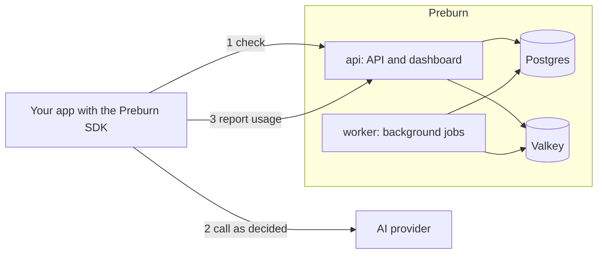

<p align="center">
  <picture>
    <source media="(prefers-color-scheme: dark)" srcset="docs/images/logo-dark.svg">
    
  </picture>
</p>

# Preburn

Preburn is a margin control plane for AI products.

Before each AI call, your app asks Preburn one question: Is this customer still profitable to serve? It gets back allow, route to a cheaper model, cap, or deny in under 250ms. Then your app calls the provider directly.

Preburn never sits between your app and the provider. No proxy, no added latency on inference, no visibility into your prompts or outputs. Per-customer margin is the revenue you record through the revenue API minus the AI cost Preburn prices from the usage your app reports back.

Preburn exists because:

- One power user is quietly eating 40% of your margin, and you'll find out when the OpenAI bill arrives.
- Cost dashboards tell you what happened last month. You need to decide what happens on the next request.
- AI gateways solve the wrong problem. They add latency, become a SPOF, and read your prompts. You wanted control, not a proxy.
- Your billing code was about to grow a bad version of this. We already wrote it.

What Preburn is not:

- Not an AI gateway. We don't proxy traffic.
- Not an observability tool. We decide. We don't just record.
- Not a rate limiter. We rate-limit on margin, not requests.

<picture>
  <source media="(prefers-color-scheme: dark)" srcset="docs/images/overview-dark.png">
  
</picture>

## How it works



1. Before a metered AI call, your app sends a check with the customer, the feature, the provider, the model and a usage estimate. Preburn prices the estimate, computes the customer's margin signals, applies the policy that matches and answers allow, route, cap or deny. Every outcome except deny reserves the estimated cost against the customer's allowance.
2. Your app runs the call as decided: as requested, on the routed model, with the capped parameters, or not at all.
3. Your app reports the measured usage. Preburn prices it, writes it to the ledger and settles the reservation.

Postgres holds every record. Valkey holds the per-customer counters that make a check fast. The worker expires reservations, repairs counters, refreshes period rollups and deletes old decisions. When the SDK cannot reach Preburn within its 250 ms check timeout, it falls back to the `on_unreachable` outcome of the last policy that matched for that customer and feature, allow by default. [docs/architecture.md](docs/architecture.md) has the details.

## Quickstart

You need Docker Engine 25 or later with Docker Compose, curl and jq, and Python 3.10 to 3.14 for the SDK step.

### 1. Download the Compose file and the settings

<!-- x-release-please-start-version -->
```sh
mkdir preburn && cd preburn
curl -fsSLO https://raw.githubusercontent.com/preburn/preburn/v0.1.1/compose.yaml
curl -fsSL -o .env https://raw.githubusercontent.com/preburn/preburn/v0.1.1/.env.example
```
<!-- x-release-please-end -->

`.env` holds the settings, each with a comment. [docs/configuration.md](docs/configuration.md) lists them all.

### 2. Create the secret key

<!-- x-release-please-start-version -->
```sh
sed -i.bak "s|^PREBURN_SECRET_KEY=$|PREBURN_SECRET_KEY=$(docker run --rm ghcr.io/preburn/preburn:0.1.1 secret-key)|" .env
rm .env.bak
```
<!-- x-release-please-end -->

The command writes a new key into the empty `PREBURN_SECRET_KEY=` line of `.env`. Keep a copy of this key with your backups. See [Secret key](docs/self-hosting.md#secret-key).

### 3. Start Preburn

```sh
docker compose up -d --wait
```

Compose starts Postgres and Valkey, runs `migrate` once to create the schema and import the pricing catalog, then starts `api` and `worker`. The dashboard and the API listen on http://localhost:8080, reachable from this machine only.

### 4. Finish setup

```sh
docker compose logs api | grep setup_link_created
```

Open the `url` of the last line, `http://localhost:8080/setup#...`, and create the first member. The api logs a new link each time it starts while setup is pending, and `docker compose exec api /preburn admin setup-link` prints one. To create the first member from the terminal instead, run `docker compose exec api /preburn admin create --email you@example.com --name "Your Name"`.

### 5. Create an API key

In the dashboard, keep Test selected at the top of the sidebar, open API keys and click Create API key. Enter a name, choose the Runtime scope and copy the key, which is shown once. Or create the key from the terminal:

```sh
docker compose exec api /preburn admin api-key create --environment test --scope runtime --name quickstart
```

Export the key and the server address. Replace the key with yours:

```sh
export PREBURN_BASE_URL=http://localhost:8080
export PREBURN_API_KEY=pb_test_runtime_...
```

### 6. Send a check and a report

```sh
curl -sS "$PREBURN_BASE_URL/api/v1/check" \
  -H "Authorization: Bearer $PREBURN_API_KEY" \
  -H "Content-Type: application/json" \
  -d '{"customer_id": "customer_42", "feature": "chat", "provider": "openai", "model": "gpt-6-luna", "usage_estimate": {"input_tokens": "1200", "output_tokens": "400"}}' \
  -o decision.json
jq . decision.json
```

The decision allows the call with reason `no_policy_matched`, because no policy exists yet, and reserves its estimated cost until the report arrives or `expires_at` passes. Report the usage the call measured:

```sh
jq '{decision_source: "server", decision_id, usage: {input_tokens: "1180", output_tokens: "312"}}' decision.json \
  | curl -sS "$PREBURN_BASE_URL/api/v1/report" \
      -H "Authorization: Bearer $PREBURN_API_KEY" \
      -H "Content-Type: application/json" \
      --data @-
```

The answer holds the ledger entry and its cost:

```json
{"ledger_entry_id":"led_01m3g49v5jfa99t8g10x814878","cost":"0.000274000","cost_status":"costed","duplicate":false}
```

### 7. Run the Python SDK example

```sh
python3 -m venv .venv
. .venv/bin/activate
pip install "preburn @ git+https://github.com/preburn/sdk-python@v0.1.0"
curl -fsSLO https://raw.githubusercontent.com/preburn/sdk-python/v0.1.0/examples/check_and_report.py
python check_and_report.py
```

The example checks a chat call, runs a stand-in for the model call and reports its usage:

```
decision outcome=allow reason=no_policy_matched reserved=0.000201500 fallback=False
call provider=openai model=gpt-6-luna overrides={}
report ReportResult(ledger_entry_id='led_01m3g4a92zfrra961gabxekttk', cost=Decimal('0.000101500'), cost_status='costed', duplicate=False)
```

Open Decisions in the dashboard to see both checks. The [SDK README](https://github.com/preburn/sdk-python#readme) covers fallback, buffered reports, the async client and the OpenAI wrapper.

### Next steps

- Create a plan in Plans with a margin target or a fixed AI allowance, and make it the default plan in Settings.
- Record revenue for your customers with `POST /api/v1/revenue` or the SDK's `revenue.record`.
- Write a policy in Policies. [docs/policies.md](docs/policies.md) explains the document and has examples.


## Configuration

Preburn reads its settings from environment variables, which Compose takes from `.env`. [docs/configuration.md](docs/configuration.md) lists every variable with its default.

## Upgrading

Preburn is at 0.x, so a minor release can change the API and the configuration. Read the [changelog](CHANGELOG.md) before you upgrade, and take a backup. Then set `PREBURN_VERSION` in `.env` to the new version and restart:

```sh
docker compose pull
docker compose up -d --wait
```

`migrate` applies the new migrations before `api` and `worker` start. [docs/self-hosting.md](docs/self-hosting.md#upgrades) describes backups and upgrades.

## Documentation

| Page | Contents |
|---|---|
| [Concepts](docs/concepts.md) | Glossary, periods, plans, signals, outcomes, the decision lifecycle and pricing |
| [Policies](docs/policies.md) | The policy document, resolution and examples |
| [API](docs/api.md) | Authentication, route groups, lists, idempotency and the endpoints |
| [Errors](docs/errors.md) | Every error code with its status and fix |
| [Configuration](docs/configuration.md) | Every environment variable |
| [Self-hosting](docs/self-hosting.md) | TLS, backups, upgrades, scaling, sizing and the secret key |
| [Architecture](docs/architecture.md) | Components, the request path, Postgres and Valkey, jobs |
| [Development](docs/development.md) | Make targets, the development stack and tests |
| [Releasing](docs/releasing.md) | How releases are cut and published |

The running server serves its OpenAPI document at `/api/v1/openapi.json` and a reference page at `/api/docs`.

## Contributing

See [CONTRIBUTING.md](CONTRIBUTING.md) and the [Code of Conduct](CODE_OF_CONDUCT.md). Report vulnerabilities as described in [SECURITY.md](SECURITY.md).

## License

[Apache License 2.0](LICENSE). The pricing catalog includes model price data from LiteLLM under the MIT License. See [NOTICE](NOTICE).
